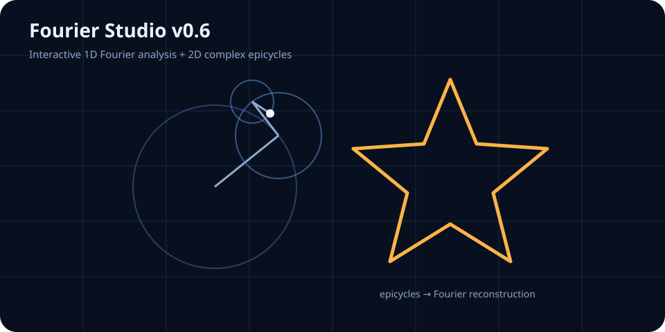

# Fourier Studio

<p align="center">
  
</p>

一个纯浏览器运行的交互式傅里叶可视化工具：从一维傅里叶级数、频谱与旋转相量，到二维复傅里叶绘图、文字 / 图片轮廓提取与结果导出。

**Live Demo:** https://teeis3124-star.github.io/fourier-studio/

## v0.6

这一版重点是把项目从“算法实验”整理成更完整的可展示工具。

### 模式切换
- **总览**：显示全部实验区
- **一维傅里叶**：只显示时域重建、公式、相量、误差与频谱
- **二维复傅里叶**：只显示手绘 / 文字 / 图片轮廓与复傅里叶动画
- 浏览器会记住上一次选择的模式

### 一维 Fourier Studio
- 512 点周期采样
- 最高 64 阶傅里叶重建
- 鼠标 / 触控笔直接手绘目标周期函数
- 正弦、方波、锯齿、三角、脉冲预设
- 实时显示具体傅里叶级数
- 精简零项 / 完整公式切换
- 点击公式项高亮对应谐波
- 一键复制 LaTeX
- 幅度谱与相位谱
- RMS 重建误差
- 一维 Fourier Epicycle 动画

### v0.6 新增：误差与主要分量
- 自动计算 `N = 1 ... 64` 的 RMS 重建误差
- 显示“误差—阶数”曲线
- 点击误差曲线可快速切换阶数
- 对当前 `N` 内的谐波按
  `sqrt(a_n^2+b_n^2)`
  排序
- 显示幅值最大的 8 个傅里叶分量
- 点击排行榜中的分量可直接高亮对应谐波

### 二维 Complex Fourier Drawing
- 自由手绘二维路径
- 自动闭合并按弧长重采样为 256 点
- 将路径表示为复函数 `z(t)=x(t)+iy(t)`
- 双边复傅里叶系数 `k=-K,...,K`
- `K=1...60`
- 旋转圆首尾相接实时重绘路径
- 暂停、继续、重新播放和速度调节
- 内置星形示例

### 文字 / 图片轮廓导入
- 输入短文字自动转轮廓
- 支持中文与英文，实际字体由本机浏览器决定
- 上传 PNG / JPG / WebP 等浏览器支持图片
- 本地浏览器处理，不上传服务器
- 灰度阈值实时调节
- 使用 Marching Squares 提取有序闭合轮廓
- 多块轮廓按最近距离拼接成连续路径
- 最终路径继续进入复傅里叶分析

### v0.6 新增：导出
- 一维时域图导出 PNG
- 一维旋转相量导出 PNG
- 二维复傅里叶画布导出 PNG
- 二维动画导出循环 GIF
- GIF 使用项目内置编码器，不依赖 CDN 或第三方运行库
- 当前 GIF 导出为 36 帧、缩放后的轻量版本，适合 README、演示与分享

## 数学原理

### 一维傅里叶级数

在 `[-π, π)` 上：

`f_N(x) = a0/2 + Σ[a_n cos(nx) + b_n sin(nx)]`

离散近似：

`a_n ≈ (2/M) Σ f(x_i) cos(n x_i)`

`b_n ≈ (2/M) Σ f(x_i) sin(n x_i)`

其中 `M=512`。

第 `n` 阶谐波幅值：

`A_n = sqrt(a_n^2 + b_n^2)`

### RMS 重建误差

`RMS(N) = sqrt((1/M) Σ [f(x_i)-f_N(x_i)]^2)`

程序会从 `N=1` 连续计算到 `N=64`，用于展示阶数增加时的重建误差变化。

### 二维复傅里叶

二维路径：

`z_j = x_j + i y_j`

复傅里叶系数：

`c_k = (1/M) Σ z_j exp(-i 2π k j / M)`

重建：

`z_K(t) = Σ c_k exp(i k t)`

每个 `c_k` 对应一个旋转向量：

- 半径：`|c_k|`
- 角速度：`k`
- 初相位：`arg(c_k)`

旋转向量首尾相接后，末端轨迹就是有限阶复傅里叶重建。

## 轮廓处理流程

文字：

`文字 → Canvas 栅格化 → 灰度二值化 → Marching Squares → 闭合轮廓 → 路径拼接 → 弧长重采样 → 复傅里叶`

图片：

`本地图片 → 离屏 Canvas → 灰度阈值 → Marching Squares → 闭合轮廓 → 路径拼接 → 弧长重采样 → 复傅里叶`

当前最适合：
- Logo
- 图标
- 黑白剪影
- 简单线稿
- 深色图形 + 浅色背景

复杂照片通常会产生大量小轮廓，可通过调节灰度阈值减少噪声。

## 运行

用任意静态服务器打开仓库根目录的 `index.html`。

开发：

```bash
npm install
npm test
```

`npm test` 会执行 TypeScript 类型检查与完整构建。仓库包含 GitHub Actions CI。

## 项目结构

- `index.html`：页面结构
- `style.css`：界面样式
- `src/main.ts`：TypeScript 主源码
- `js/main.js`：浏览器直接运行版本
- `docs/demo.svg`：README 展示图
- `scripts/build.mjs`：构建单文件版本
- `.github/workflows/ci.yml`：自动类型检查与构建

完整构建后会生成：

`dist/Fourier-Studio.html`

这是一个可离线打开的单文件版本。
